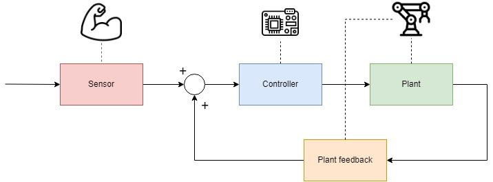

# Simple Robotic Arm Prosthetic (SRAP)
### Prototyping and control of a sEMG-based robotic transradial prosthesis

**Abstract.** As control technology continues to improve and sensors with high complexity and accuracies become more accessible, while remaining in ranges that can be considered "low-cost", the possibilities for providing disabled people with high-quality, low-cost prosthetics have become increasingly strong. A robotic limb control method based on surface electromyographic signal (SEMG) of the forearm, called SRAP (Simple Robotic foreArm Prosthetic), is proposed for the production of transradial robotic prostheses. 

First, single-channel forearm EMG data are obtained through a sensor specifically designed to acquire electromyographic signals (Myoware v1), placed on the patient's forearm. The acquired pre-filtered signal is processed through a prototyping and development board, the Nucleo-F446RE, through which and implemented a control loop on a Servo motor actuator AD-002 for simulating the movement of a prosthetic joint implemented by a plant (scaffold with robotic claw, mounted on the motor). The system also includes the ability to customize the user experience with the robotic prosthesis through a calibration and configuration protocol. Thus, the project aims to emulate a real prosthesis through a digitally controlled articulation using electrical signals transmitted from the forearm, consisting of a non-invasive, low sensor complexity and low cost procedure. 

---

<video width="320" height="240" controls>
  <source src="[movie.mp4](https://user-images.githubusercontent.com/45271396/202867532-23d5c099-6542-4566-9b85-80e460eeab35.mp4)" type="video/mp4">
</video> 

[Full Reading (it)](Relazione%20SRAP.pdf)
